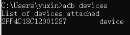
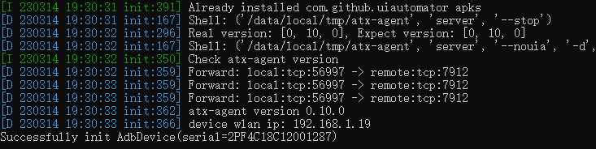
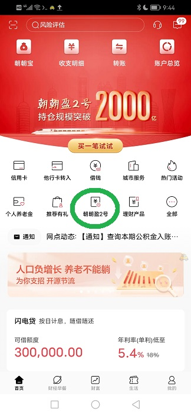

# cmb_client

招商银行安卓客户端活期理财申赎接口。

## 使用场景

我这样的老股民几乎不会梭哈（all in），账户里多多少少会有闲钱。这些钱可以转入银行买理财，每天赚几十块钱的收益。当然，这种理财必须随时可取可用，否则需要买入时因没钱而错失良机，因小失大。很多银行都有安逸型活期理财，有些支持实时赎回，这就是我们要的理财产品。

2022年底出台了一项新规，要求这类理财产品每日实时赎回额度最高不超过1万元。很多银行的应对方法就是推出了若干支持实时赎回的产品，假设共10只，那么用户其实就有了10万元的额度。PS：真是“上有政策，下有对策”。

在众多银行中，招商银行最激进，推出了一款叫做“朝朝盈2号”的活期理财产品，其底层有70只货币基金（于是每户每日有70万元的实时赎回额度），而且所有操作都一键完成（由后台智能分配到各只基金），无需像其他银行那样每一只单独操作，省时省力。“朝朝盈2号”在用户体验方面碾压其他所有产品。

对于一个量化交易系统，股票买入卖出由程序决定，那么为了实现完全的无人化，活期理财的申赎也必须能够由程序完成。于是有了这个小项目，将招商银行的申赎接口封装出来。原理很简单，运行在主控机（比如台式机）的交易程序，通过发送指令模拟人操作招商银行手机App。目前只支持安卓版App。

## 准备工作

在电脑上安装adb（自行下载安装），打开安卓手机的ADB调试（不同手机方法不同，自行百度），然后用数据线连接手机和电脑。电脑上执行命令`adb devices`能够看到手机，说明adb配置成功。



在电脑上执行`pip install uiautomator2`安装uiautomator2，随后执行`python -m uiautomator2 init`，会在安卓端安装必要组件。



在安卓手机上安装好招商银行App，先手动登录（这样就会记住账号），并将登录方式设置为密码登录（密码必须为纯数字），且禁用面容/指纹登录和手势密码登录。然后找到“朝朝盈2号”，多次进出页面，直到在“首页”页面的快捷入口里出现“朝朝盈2号”（招商银行App会根据使用频率确定快捷入口）。



## 接口

所有对外接口都可以查看__init__.py中的Client类。

### >>> 构造函数：
```
def __init__(self, app_password, trans_password, addr = None, imp_wait = 15)
```
参数app_password是app的登录密码，trans_password是交易密码（也就是可在ATM机上输入的6位密码）。addr是手机在adb中显示的名称，比如上图中就是“2PF4C18C12001287”，如果只有一部手机，那么可以填None。imp_wait是单步操作的最大隐式等待时间（秒）。

### >>> 申购（买入）朝朝盈2号：
```
def buyZZY2(self, max_money = None)
```
参数max_money指定最大申购金额，实际申购金额会取MIN(max_money, 账户可用余额)。如果max_money为None，则申购金额为全部可用余额。函数返回实际申购金额。

### >>> 赎回（卖出）朝朝盈2号：
```
def sellZZY2(self, max_money = None)
```
参数max_money指定最大赎回金额，实际赎回金额会取MIN(max_money, 可用快速赎回额度)。如果max_money为None，则金额为全部可用快速赎回额度。函数返回实际赎回金额。
